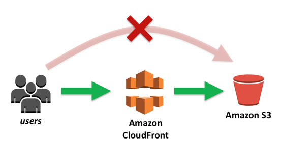

# 📌 Wallet Watcher - Cloud-Native Expense Tracker

**Wallet Watcher** is a responsive personal finance application designed for real-time tracking of income and expenses. This project demonstrates a professional deployment lifecycle—from frontend development to **Automated Cloud Infrastructure**.

## 🚀 Live Demo
**[Insert Your CloudFront URL Here]**

## 🛠 Tech Stack
* **Frontend:** HTML5, CSS3 (Dark Theme), Vanilla JavaScript (ES6+).
* **Cloud Infrastructure:**
    * **Amazon S3:** Highly durable object storage for static web assets.
    * **Amazon CloudFront:** Global Content Delivery Network (CDN) for low-latency delivery and HTTPS.
    * **Infrastructure as Code (IaC):** Defined cloud resources using Terraform for repeatability.
    * **Automation:** Bash scripting for CI/CD synchronization and cache management.

## 🏗 Cloud Architecture & Security


I have implemented a secure, production-grade architecture:
* **Restricted S3 Access:** The S3 bucket is private. Users are prevented from accessing the bucket directly (represented by the red 'X' in the diagram).
* **Origin Access Control (OAC):** Secure communication is established between CloudFront and S3, ensuring the site is only reachable through the CloudFront edge network.
* **Global Performance:** Assets are cached at global edge locations to minimize latency for users worldwide.

## 🤖 Automation & IaC
To demonstrate engineering best practices, I have included:
1.  **Deployment Template (`deploy.sh.template`)**: A custom shell script to automate the `aws s3 sync` process and trigger `aws cloudfront create-invalidation`.
2.  **IaC Methodology**: The infrastructure is defined programmatically to avoid "manual configuration drift" and ensure the environment can be recreated instantly.

## 🔹 Features
* ✅ **Real-time Analytics**: Live calculations for Total Balance, Income, and Expenses.
* ✅ **Data Persistence**: Uses Browser `localStorage` for privacy-focused data storage.
* ✅ **Modern UI/UX**: Fully responsive dark-mode interface optimized for all devices.

## 📥 Local Setup
1. Clone the repository:
   ```bash
   git clone [https://github.com/yourusername/Wallet-Watcher.git](https://github.com/yourusername/Wallet-Watcher.git)
